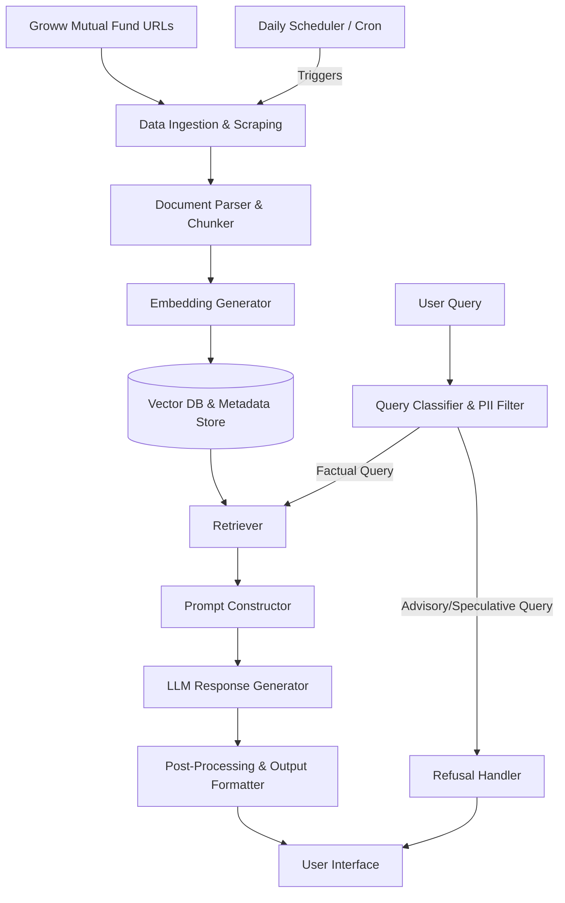
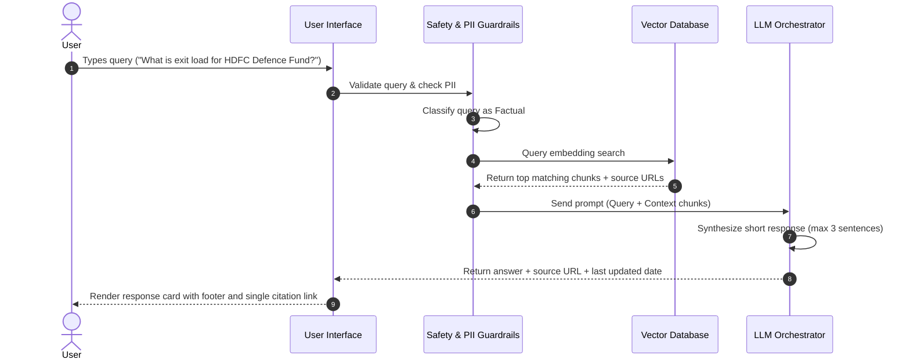

# Architecture Design: Mutual Fund FAQ Assistant (Facts-Only Q&A)

This document outlines the detailed architecture for the lightweight **Retrieval-Augmented Generation (RAG)** FAQ assistant designed to answer factual queries about mutual fund schemes (specifically HDFC Mutual Fund schemes) using Groww as the product reference context.

---

## 1. System Architecture Overview

The system is designed as a modular RAG pipeline that ingests data from specified source URLs, indexes the information, retrieves facts relevant to user queries, and generates short, compliance-focused answers.

---

## 2. Component Breakdown

### 2.1 Ingestion & Preprocessing Pipeline
* **Daily Scheduler (Cron Job)**: A time-triggered service that runs once every 24 hours. It initiates the scraping and indexing pipeline to retrieve the latest data (such as NAV, returns, and expense ratios) from the live URLs, keeping the vector database fresh and accurate.
* **Source Scraper**: Fetches HTML/document contents from the designated 7 Groww HDFC mutual fund URLs, alongside official HDFC AMC factsheets and help pages.
* **Extraction Engine**: Extracts textual details, tables (key for expense ratios, exit loads, and returns), and metadata (such as scheme name, URL, and crawling timestamps).
* **Data Cleaning & Normalization (Pre-chunking)**:
  * **Boilerplate & Noise Removal**: Strips navigation menus, headers, footers, advertisement banners, sidebar links, and cookie consents from the raw HTML to isolate the primary content.
  * **Text Cleaning**: Normalizes whitespace, removes duplicate empty lines, converts special HTML entities, and standardizes date/currency formats.
  * **Table Preservation**: Identifies tables (e.g., historical returns, scheme statistics) and converts them into Markdown/JSON representation, ensuring table structure is not lost or mangled.
* **Chunking Strategy**: 
  * Uses **semantic section splitting + pure Python recursive character chunking** (chunk size: 1200 characters, overlap: 150 characters).
  * Special handling for tabular data (preserving Markdown tables as atomic units and splitting strictly by row boundary if size limits are exceeded).

### 2.2 Embedding & Vector Storage
* **Embedding Model**: Employs the **Gemini Embedding API** (`models/text-embedding-004`) to generate 768-dimensional dense vector embeddings.
* **Vector Store**: **Pure-Python vector store** (NumPy + JSON persistence) for cosine similarity search and metadata filtering. Replaces ChromaDB, whose Rust backend crashes on Python 3.14.
* **Metadata Store**: Associates each vector with key attributes:
  * `source_url`: The exact URL the text was scraped from.
  * `scheme_name`: The name of the specific fund scheme.
  * `last_updated`: Date the content was retrieved.

### 2.3 Query Processing & Guardrails
* **PII Filter**: Before passing the user query to the database, a regex-based or lightweight NER model filters out sensitive data (PAN, Aadhaar, account numbers, email addresses, OTPs).
* **Intent Classifier**:
  * **Factual Class**: Route to retrieval engine (e.g., *"What is the exit load of HDFC Defence Fund?"*).
  * **Advisory/Speculative Class**: Route to the Refusal Handler (e.g., *"Which fund should I buy?"*).

### 2.4 Retrieval Module
* **Hybrid Retrieval**: Combines semantic search (vector database) with keyword search (BM25) to accurately match terms like "ELSS", "SIP", "AUM", or exit load percentages.
* **Reranking (Optional)**: Employs a cross-encoder (e.g., Cohere Rerank or BGE-Reranker) to rank the top $K$ chunks (e.g., top 3) and ensure the most relevant context is selected.

### 2.5 Refusal Handler
If a query is classified as advisory or non-factual:
* Skips the RAG pipeline.
* Generates a polite refusal (e.g., *"I can only provide factual details and cannot offer investment advice."*).
* Appends an educational resource link (e.g., SEBI Investor Education or AMFI guidelines).

### 2.6 LLM & Post-Processing (Output Formatter)
* **Contextual Prompt**: Instructs the LLM (e.g., Llama 3.1 via Groq) to rely **exclusively** on the provided context. If the answer is not present in the context, it must state that the information is unavailable.
* **Constraint Enforcement**:
  * Limit the response to a maximum of **3 sentences**.
  * Use **exactly one** citation link matching the source of the context.
  * Append the footer format: `Last updated from sources: <date>`.

---

## 3. Data Flow Diagram

The sequence below illustrates a successful factual query flow:

---

## 4. Technology Stack Suggestions

* **Frontend**: Vanilla HTML/JS with modern styling or a minimal React/Next.js SPA.
* **Backend Framework**: Python (FastAPI) for lightweight API routing.
* **RAG Orchestrator**: LlamaIndex or LangChain.
* **Vector Store**: Pure-Python Vector Store (NumPy + JSON persistence).
* **Scraper**: BeautifulSoup4 / Playwright for fetching Groww mutual fund pages.
* **LLM API**: Groq API (using Llama 3.1 8B for fast inference speed and cost efficiency).

---

## 5. Security & Privacy Compliance

* **No Storage of PII**: The system operates statelessly with respect to user identity. Input text is stripped of any PII markers immediately at ingestion.
* **Strict Fact-Locking**: The prompt template uses severe system-level instructions prohibiting the model from hallucinating or utilizing pre-trained financial knowledge outside the retrieved context.
